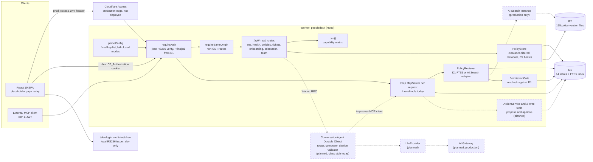

# PeopleDesk

An employee self-service agent for Cloudflare Workers, designed to answer policy questions with citations to a specific, effective-dated document version, and to take actions such as opening a ticket or booking an orientation session only after the requesting employee approves them.

## Status

**v1 is in active development.** The build follows a 25-commit plan in [SPEC.md section 21](SPEC.md#21-commit-plan). Commits 1 to 15 are done; the next is commit 16 (approval checkpoints and the two write tools). [PROGRESS.md](PROGRESS.md) is the live record of where the build stands and where it deviates from the spec.

| | |
|---|---|
| **Works today** | Deterministic synthetic organization and versioned policy corpus (committed); D1 schema and local seeding of D1 and R2; Access-shaped JWT authentication with a local dev issuer; a table-tested authorization matrix; permission-aware retrieval (D1 FTS5 retriever, AI Search adapter, PermissionGate); a read-only HTTP API for policies, tickets, onboarding, orientation sessions and team; an MCP server at `/mcp` with the four read tools, plus the in-process MCP client the chat agent will use |
| **Tests** | 243 tests in 29 files across five Vitest projects, all passing. Measured by running `npm test` on 2026-10-08 at commit 15 |
| **Not built yet** | The two write tools and approval checkpoints, LLM providers, the chat agent, the React UI (today a placeholder page), the 200-case eval harness |
| **Deployed** | No. Nothing runs on Cloudflare yet. Deploying needs a Cloudflare login (`npx wrangler login`) and the steps in [SPEC.md section 18](SPEC.md#18-deploy-steps-for-when-nitish-logs-in-to-cloudflare) |
| **CI** | [`.github/workflows/ci.yml`](.github/workflows/ci.yml) runs typecheck, dataset determinism, tests, build, an offline deploy dry run and a generated-types check. As of 2026-10-08 the GitHub run fails at the determinism step, because it diffs `evals/dataset/`, which commit 22 creates. Locally, typecheck, test, build and `deploy:check` pass (PROGRESS.md) |

## Why

People and Places teams answer the same questions all day: how much leave carries over, what the travel per diem is, whether a new hire has booked orientation. Two things make these questions hard to automate safely.

1. **The right answer depends on who is asking and when.** Some policies are for managers or HR only, and policies change: a version can be superseded, or approved but not yet in effect. An assistant that quotes last year's number, or a manager-only threshold to an individual contributor, is worse than no assistant.
2. **The useful follow-ups change records.** Opening a ticket or booking someone into a session is a write. A language model should be able to propose it, never perform it.

PeopleDesk is designed around those two constraints: every answer cites a document version with its effective dates, retrieval is filtered by the caller's clearance and re-checked against the database, and anything that changes a record waits for an approval that only the requesting human can give.

## Features

| Feature | Status |
|---|---|
| Synthetic org and policy corpus generator: 100 documents, 155 versions, 120 employees, with the same output hash on macOS, on the Linux CI runner and under other time zones | Implemented |
| D1 schema (4 migrations, FTS5 index kept in sync by triggers) and local seeding of D1 and R2 | Implemented |
| Authentication: RS256 JWT verification with a remote JWKS (Access) or a local JWKS (dev and tests), principal resolution from D1, identity links, service-token gating | Implemented |
| Dev login: persona picker at `/dev/login` and an Access-shaped token issuer at `/dev/token` (dev mode, localhost only) | Implemented |
| Authorization: `can(principal, capability)` as one pure function, with every role and identity kind covered by a matrix test | Implemented |
| Policy browsing API: clearance-filtered list, version history labelled current, superseded or scheduled, version bodies from R2 with an audit row | Implemented |
| Read API: `/api/me`, `/api/health`, own tickets, onboarding progress (self, manager of, HR), orientation sessions with seats remaining, team view | Implemented |
| Permission-aware retrieval: D1 FTS5 retriever, AI Search adapter, PermissionGate, chunk alignment for citations | Implemented; served through the `search_policies` MCP tool |
| Typed MCP tools over Streamable HTTP at `/mcp`, behind the same JWT auth as the API: `search_policies`, `list_my_tickets`, `get_onboarding_progress`, `list_orientation_sessions` | Implemented (commit 15) |
| The two write tools, `create_support_ticket` and `schedule_orientation_session`, which only propose | Planned (commit 16; definitions and schemas exist, not yet registered) |
| In-process MCP client, so the chat agent goes through the same validation and authorization as an external client | Implemented (commit 15); its caller, the chat agent, is planned |
| Approval checkpoints: write tools create a pending action; only the requesting user identity can approve, through one atomic D1 batch | Planned (commit 16; the `pending_actions` table exists) |
| LLM providers: Workers AI through AI Gateway, OpenAI-compatible (local llama-server), deterministic stub, adversarial stub | Planned (commit 17; config parsing and the production guard exist) |
| Chat agent: one Durable Object per conversation, router and composer calls, citation validator | Planned (commit 18; the Durable Object class is an empty stub) |
| React UI: chat with citation chips and source drawer, approval cards, request forms, policy viewer with version timeline | Planned (commits 20, 21; today a placeholder page and one component) |
| Evaluation harness: 200 cases, deterministic scoring, leak check, latency and cost reporting | Planned (commits 22, 23, 25) |

## Architecture

Solid boxes exist in the code today. Dashed boxes are designed in [SPEC.md](SPEC.md) and not built yet.



The designed request paths for a cited policy answer and for an approved action are sequence diagrams in [SPEC.md section 2](SPEC.md#2-architecture).

## Key design decisions

Each item says whether it is implemented or designed. Section links point into SPEC.md, the build contract; the repo has no separate ADRs.

**Identity comes only from a verified JWT** (implemented). One `JwtIdentityVerifier` serves both modes: production verifies the `Cf-Access-Jwt-Assertion` header against the Access team JWKS; dev and tests verify against a local JWKS with the same jose call (RS256 only, issuer, audience, expiry, 30 s clock tolerance). The verified email or service-token name is mapped to an active employee row in D1; request bodies never carry identity. The remote-JWKS path is tested offline by serving the keys through the test pool's outbound handler. See [section 9](SPEC.md#9-auth-model).

**Configuration fails closed** (implemented). `parseConfig` reads a fixed list of 17 keys and ignores everything else. Dev mode answers 500 on any hostname other than `localhost`, `127.0.0.1` or `[::1]`, so an accidental production deploy in dev mode cannot accept dev tokens. The test-only LLM providers are rejected when `AUTH_MODE=access`. No header, cookie or query parameter can change the auth mode, provider or retriever. Every Vitest workerd project pins all 17 keys (enforced by a `satisfies Record<ConfigKey, string>` type), so a developer's `.dev.vars` cannot change what the tests run against.

**Authorization is one pure function** (implemented). `can(principal, capability)` encodes the capability table from [section 9](SPEC.md#9-auth-model), and `test/node/authz.matrix.test.ts` enumerates every role, identity kind and capability. The identity kind is part of the principal, so "a service token can propose and reject but never approve" is a row in the matrix rather than a check hidden in a route.

**A restricted document looks exactly like a missing one** (implemented). `GET /api/policies/POL-010` as an employee answers the same 404 as `POL-999`. Onboarding lookups outside the caller's scope also answer 404, and write an `authz_denied` audit row.

**Retrieval is filtered twice** (implemented). Each retriever filters by clearance and effective date in the query itself (SQL `WHERE` clauses for D1 FTS5, metadata filters for AI Search). `PermissionGate` then re-checks every returned passage against D1 in one round trip, drops anything above clearance or outside its effective range, and overwrites dates and source keys with D1's values. A misconfigured index filter therefore cannot leak a passage. See [section 11](SPEC.md#11-retrieval-providers-and-local-fallbacks).

**A broken index cannot pass for a correct refusal** (implemented through the MCP tool; the chat-turn mapping lands with the agent). The AI Search adapter sets `return_on_failure: false`, whose default would turn a failing filter into an empty result, and therefore into a plausible "I couldn't find that". Both retrievers throw `RetrievalError` instead, and `search_policies` returns it as a `retrieval_unavailable` tool error, never as an empty list.

**MCP tools share one authorization path** (implemented). `/mcp` runs the same `requireAuth` as the API, then the agents stateless handler builds a fresh `McpServer` bound to the verified principal for each request. The verified JWT is never forwarded in the MCP auth context. Tool metadata and JSON Schemas are computed once per isolate (the zod schemas are wrapped so the SDK's JSON Schema conversion is memoized), so the per-request factory only binds the principal and services. Inputs are strict (`additionalProperties: false`), there is no parameter that names another person's tickets, and every call that reaches a tool writes a `tool_call` or `authz_denied` audit row. The chat agent's in-process client calls the same handler, so it cannot skip a check an external client faces. See [section 10](SPEC.md#10-the-six-mcp-tools).

**User text cannot change the search query** (implemented). The FTS5 query builder lowercases, keeps at most 12 `[a-z0-9]+` tokens, drops stopwords, and emits `"tok1" OR "tok2"`, so FTS5 operators typed by a user are inert.

**Citations stay precise with AI Search** (implemented). AI Search chunks carry no section, so each one is aligned to the D1 chunk of the same version with the highest token Jaccard overlap; below 0.2 the citation is labelled an excerpt instead of guessing a section.

**Business date versus wall time** (implemented). Effective ranges are half-open `[effective_from, effective_to)`. In dev mode only, a `FixedClock` pins the business date to `AS_OF_OVERRIDE` (2026-10-01 by default); timestamps and action expiry always use wall time.

**Provider interfaces** (retriever implemented; LLM designed). `PolicyRetriever` has two implementations selected by `RETRIEVER`. `LlmProvider` will have four (`workers-ai`, `openai-compatible`, `stub`, `adversarial-stub`) selected by `LLM_PROVIDER`, with no silent fallback between them. The designed chat turn calls the router model before any document text is seen and gives the composer no tool path, so text inside a policy document cannot trigger an action. See [section 7](SPEC.md#7-durable-object-conversationagent).

**Approval as a single D1 transaction** (designed for commit 16; the table exists). Write tools never write: they create a `pending_actions` row. Proposing is one conditional `INSERT ... SELECT ... WHERE (pending count) < 5`, so two concurrent proposals cannot both pass a rate-limit check. Approving runs read-only checks first (requester, user identity, digest, re-authorization against current D1 state), then sends one `DB.batch`: claim the row with a fresh `claim_id`, execute the ticket or booking insert, finalize, and audit, with every statement after the claim gated on that `claim_id`. A losing concurrent approver changes nothing, a retry by the same requester replays the stored outcome (idempotent approve), and no row is left half-executed. `arguments_sha256` is an integrity check against serialization drift, not a security control, since anyone who can write the row can rewrite both columns. See [section 6](SPEC.md#6-d1-schema-and-migrations).

**Deterministic synthetic data** (implemented). The generator is pure TypeScript with no Node or Workers APIs, using sfc32 seeded from a cyrb128 hash of a fixed string, with a named sub-stream per decision so changing one field does not reshuffle the rest. Every date is an offset from the business date, all date math is UTC, and output is LF-only. A test regenerates the dataset under `TZ=America/Los_Angeles` and `TZ=Asia/Kolkata` and compares hashes. The generator also enforces that no number in a manager-only or HR-only fact appears anywhere in a document a lower clearance can read, so the planned eval leak check can detect a leak by its numbers. See [section 12](SPEC.md#12-synthetic-data-generator).

**One seed source, two consumers** (implemented). `seedStatements()` produces parameterized statements. Worker tests apply them through `DB.batch`; `seed.sql` renders the same list for `wrangler d1 execute`, writing newlines inside text as `char(10)` because SQLite has no backslash escapes. A round-trip test runs the file through local wrangler.

## Tech stack

Versions are the exact pins in `package.json`.

| Area | Packages |
|---|---|
| Runtime | Cloudflare Workers (`compatibility_date` 2026-10-01, `nodejs_compat`); Node 25.9.0 (`.nvmrc`) runs the `.ts` scripts natively |
| Language | TypeScript 7.0.2 |
| Worker | Hono 4.13.13, @hono/zod-validator 0.9.1, zod 4.6.5, jose 6.2.12 |
| Agents and MCP | agents 0.27.0, @modelcontextprotocol/server 2.0.0, @modelcontextprotocol/client 2.0.0, @modelcontextprotocol/sdk 1.30.0 (a peer of agents, not imported) |
| Web | React 19.3.0, react-dom 19.3.0, react-router 8.4.0 |
| Build and local runtime | Vite 8.3.4, @cloudflare/vite-plugin 1.63.1, @vitejs/plugin-react 6.1.2, wrangler 4.149.0 |
| Tests | Vitest 4.1.11; the Workers Vitest integration `@cloudflare/vitest-plugin` 1.3.7 (the renamed `@cloudflare/vitest-pool-workers`); happy-dom 20.14.5; @testing-library/react 16.3.3; @testing-library/dom 10.4.2 |

## Getting started

Requires Node 25.9.0 or later (`nvm use` reads `.nvmrc`). After `npm ci`, everything below runs offline.

```bash
npm ci
npm run dev:keys     # writes .dev.vars: a local RS256 key pair for the dev token issuer
npm run generate     # optional: regenerates data/generated/asof-2026-10-01 (committed; output is byte-identical)
npm run seed:local   # applies D1 migrations, loads seed.sql, uploads the 155 policy files to local R2
npm run dev          # Vite + workerd on http://localhost:5173
```

`npm run dev:keys` is required: without a key pair in `.dev.vars`, config validation fails and every route answers 500 `misconfigured`. Do not copy [`.dev.vars.example`](.dev.vars.example) by hand; it documents the keys the script writes. `.dev.vars` is gitignored. Set `INSPECTOR_PORT` if the default workerd inspector port is taken.

Then open <http://localhost:5173/dev/login>, pick one of the six personas, and you are redirected to `/`. The page there is a placeholder until the UI commits; the API is where the work is visible today. With the session cookie set, open for example:

- <http://localhost:5173/api/me>
- <http://localhost:5173/api/policies?category=time_off>
- <http://localhost:5173/api/policies/POL-014>: one document with a superseded, a current and a scheduled version

The same from a terminal, signing in as the tenured employee:

```bash
O=http://localhost:5173
TOKEN=$(curl -s -X POST $O/dev/token -H "Origin: $O" -H 'Content-Type: application/json' \
  -d '{"email":"emeka.adeyemi@peopledesk.test"}' | node -pe 'JSON.parse(require("fs").readFileSync(0,"utf8")).token')
curl -s $O/api/health -H "Cf-Access-Jwt-Assertion: $TOKEN"
curl -s $O/api/policies/POL-010 -H "Cf-Access-Jwt-Assertion: $TOKEN"   # HR-only: 404, same as POL-999

# The MCP endpoint takes the same token
curl -s -X POST $O/mcp -H "Cf-Access-Jwt-Assertion: $TOKEN" \
  -H 'Content-Type: application/json' -H 'Accept: application/json, text/event-stream' \
  -d '{"jsonrpc":"2.0","id":1,"method":"tools/call","params":{"name":"search_policies","arguments":{"query":"wellness stipend maximum","topK":2}}}'
```

The search returns passages from `POL-014` version 2, the version in effect on the business date, with its effective range and R2 source key; the superseded version 1 and the scheduled version 3 are never returned. `"method":"tools/list"` lists the tools.

Checks:

```bash
npm test               # all five Vitest projects
npm run typecheck      # worker, web and node tsconfigs
npm run build          # Vite build of the SPA and the Worker
npm run preview        # build, then serve it on http://localhost:4173
npm run deploy:check   # production build + wrangler deploy --dry-run; offline, no login needed
npm run db:reset:local # delete local D1, R2 and Durable Object state, then reseed
npm run types          # regenerate worker-configuration.d.ts
```

`package.json` also declares scripts for later commits (`llm:serve`, `eval`, `eval:readme`, `seed:remote`, `link-identity`, `verify:ai-search`, `verify:gateway`). Their script files do not exist yet. `deploy` and `deploy:eval-window` need a Cloudflare login.

### Personas

All six are synthetic employees from the generated org, with `.test` email addresses.

| Persona | Employee | Role | Profile |
|---|---|---|---|
| `new_hire_unbooked` | E0025 | employee | In onboarding, no orientation booking |
| `new_hire_booked` | E0022 | employee | In onboarding, already booked |
| `tenured_employee` | E0023 | employee | No onboarding plan |
| `manager_with_new_hires` | E0007 | manager | Five direct reports in onboarding, three unbooked |
| `manager_no_new_hires` | E0014 | manager | No direct reports in onboarding |
| `hr_admin` | E0016 | hr_admin | Policy clearance 3 |

## Tests

Five Vitest projects, so each configuration the Worker reads from its environment gets its own workerd instance. Counts are from the 2026-10-08 run.

| Project | Runs in | Files | Tests | Covers |
|---|---|---|---|---|
| `node` | Node | 10 | 136 | Generator counts and determinism, PRNG, seed round trip through local wrangler, authz matrix, config parsing, FTS query builder, number normalizer, toolchain pins |
| `worker` | workerd, D1 and R2 freshly migrated and seeded per file | 15 | 93 | API contract, dev and Access JWT handling, dev-mode host guard, identity links, pinned config, migrations, seeded counts, policy API, both retrievers and the PermissionGate, MCP `tools/list`, tool input validation and tool authorization |
| `worker-access` | workerd, `AUTH_MODE=access` | 2 | 9 | The production remote-JWKS path, with keys served by an outbound handler |
| `worker-adversarial` | workerd, adversarial LLM stub | 1 | 1 | Project wiring only; the safety tests arrive with commit 19 |
| `web` | happy-dom | 1 | 4 | `EffectiveDateBadge` |

## Local versus production

**Nothing is deployed yet.** `env.production` in [`wrangler.jsonc`](wrangler.jsonc) declares the production bindings, and `npm run deploy:check` validates them with an offline `wrangler deploy --dry-run`. An actual deploy needs `npx wrangler login` and the steps in [SPEC.md section 18](SPEC.md#18-deploy-steps-for-when-nitish-logs-in-to-cloudflare). No local stand-in below is the production service, and none of the production services has served traffic.

| Cloudflare service | Production design | Local stand-in | State today |
|---|---|---|---|
| Workers | Worker `peopledesk` with static assets and SPA fallback | workerd through `@cloudflare/vite-plugin` (`npm run dev`, `npm run preview`) and through the Vitest integration in tests | Runs locally |
| D1 | Database `peopledesk` | Miniflare SQLite under `.wrangler/state` | Migrations and seed run locally |
| R2 | Bucket `peopledesk-policies`, one object per policy version with custom metadata | Miniflare R2 | 155 objects seeded locally |
| Access | Access at the edge; the Worker verifies the JWT against the team JWKS | Local RS256 issuer at `/dev/token`, verified by the same code against a local JWKS | Verifier implemented; remote-JWKS path tested offline |
| AI Search | Instance `peopledesk-policies` indexing the R2 bucket, hybrid retrieval with reranking | D1 FTS5 with bm25 (AI Search has no local emulation) | Adapter implemented and tested against a fake; never run against a real instance |
| Workers AI | `@cf/meta/llama-3.3-70b-instruct-fp8-fast` in JSON mode | Planned: a deterministic stub, or Qwen3-1.7B on llama-server through the OpenAI-compatible provider | Planned (commit 17) |
| AI Gateway | Gateway `peopledesk` for latency, token and cost logs | None; local cost figures will be labelled as list-price estimates, never as costs incurred | Planned (commit 17) |
| Durable Objects | `ConversationAgent`, SQLite-backed, one per conversation | Miniflare Durable Objects | Binding declared; agent planned (commit 18) |
| Workflows | Not used: approvals are a D1 state machine | n/a | Out of scope for v1 |
| Queues | Not used: there are no background jobs | n/a | Out of scope for v1 |

## Data

Every person, department, policy, ticket and session is synthetic, generated by `src/shared/synth/` for the business date 2026-10-01 and committed under [`data/generated/asof-2026-10-01/`](data/generated/asof-2026-10-01). There are no real HR, ticketing or calendar systems behind it; tickets, onboarding plans and orientation bookings are D1 tables. Policy text is assembled from 9 fact archetypes and 100 short blueprint rows, not written by hand per document.

| Entity | Count |
|---|---|
| Policy documents | 100: 10 categories of 10, audiences 70 all, 20 managers, 10 HR |
| Policy versions (one R2 file each) | 155: 100 current, 47 superseded, 8 scheduled |
| Facts | 359 |
| Retrieval chunks | 930 (6 sections per version) |
| Employees | 120: 100 employees, 15 managers, 5 HR admins; regions US 60, IN 40, UK 20; 6 departments |
| Onboarding plans and tasks | 30 plans, 360 tasks |
| Orientation sessions | 24 (16 virtual, 8 in person), 18 seeded bookings |
| Support tickets | 150 across 6 categories and 4 statuses |
| Personas | 6 |
| Eval cases | 200 planned (commit 22): 70 answerable, 25 outdated-document, 20 ambiguous, 30 unauthorized, 55 action requests |

These counts live in `src/shared/synth/counts.ts` and are asserted against the generated corpus and the seeded D1 by tests. The committed dataset's hash is `6dea5cee1aa9a56cede942717a4a37402779c847e7629017920c58fd2e9a3626`, and `/api/health` reports the hash of whatever is seeded.

## Roadmap

Remaining items from the commit plan ([SPEC.md section 21](SPEC.md#21-commit-plan)). P0 completes v1; P1 starts only after it.

| # | Item | Priority |
|---|---|---|
| 16 | Single-batch approval, atomic rate limit, write tools and approval endpoints, with a crash-after-commit test | P0 |
| 17 | Workers AI, OpenAI-compatible, stub and adversarial providers with AI Gateway log readers | P0 |
| 18 | ConversationAgent, turn lock, directory slice, router and composer orchestration, citation validator | P0 |
| 19 | Safety tests: adversarial model, service-token approval denial, no approval via chat | P0 |
| 20 | Web: app shell, chat with citations, source drawer and approval cards | P0 |
| 21 | Web: policy list and viewer, request forms, tickets, onboarding and actions pages | P0 |
| 22 | 200-case eval dataset generator with invariant tests | P0 |
| 23 | Eval runner, scorer, leak check, report, abort rules and an in-pool smoke test | P0 |
| 24 | Full README: deploy steps, MCP usage, eval metric definitions | P0 |
| 25 | First local eval run with Qwen3-1.7B, results written into this README from `summary.json` | P0 |
| 26 | Home page, manager onboarding view, ticket status filter | P1 |
| 27 | Dark theme and policy viewer tests | P1 |
| 28 | R2 S3 API fallback and link-identity polish for remote seeding | P1 |

Carried forward from commit 13: the AI Search adapter test still needs its turn-level case (a throwing retriever makes the chat turn return `retrieval_unavailable`), which depends on commit 18.

## Results

No eval run recorded yet. This section will be written by `npm run eval:readme` from a real run's `summary.json`, with the provider, model and retriever it came from. The target for correct, source-grounded answers is 90%; no measured number exists yet.

## License

[MIT](LICENSE)
